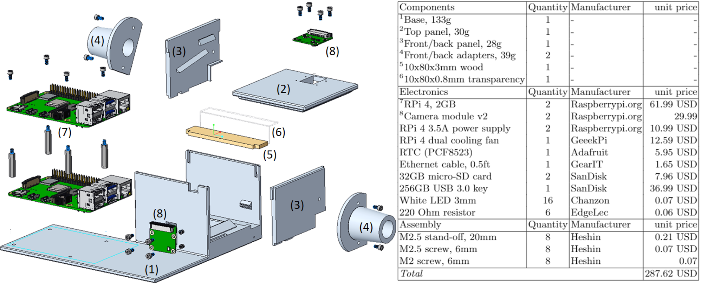

This folder contains stl-files for the 3D printed enclosure. 
These files can be printed on any filament printer. We recommend white PLA as it helps reflect the light inside the enclosure.
The top, front and rear panels and the adapter pieces can be printed without support. 
The base needs support. 

For reference, we printed our tunnels on a Prusa MK3S+ with 0.6mm nozzle. We added 40% infill and 0.3mm layer height (Quality setting). 

